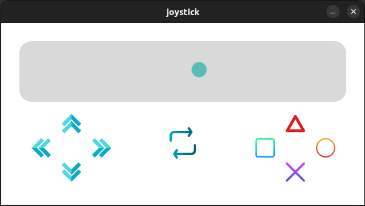

# Joystick publishing in ROS2 with QT

The purpose of the joystick screen designed with QT is to publish the values of the buttons. An additional button is used to switch between left and right usage.

**Note:** Different button effects were added to simulate button presses.

[]